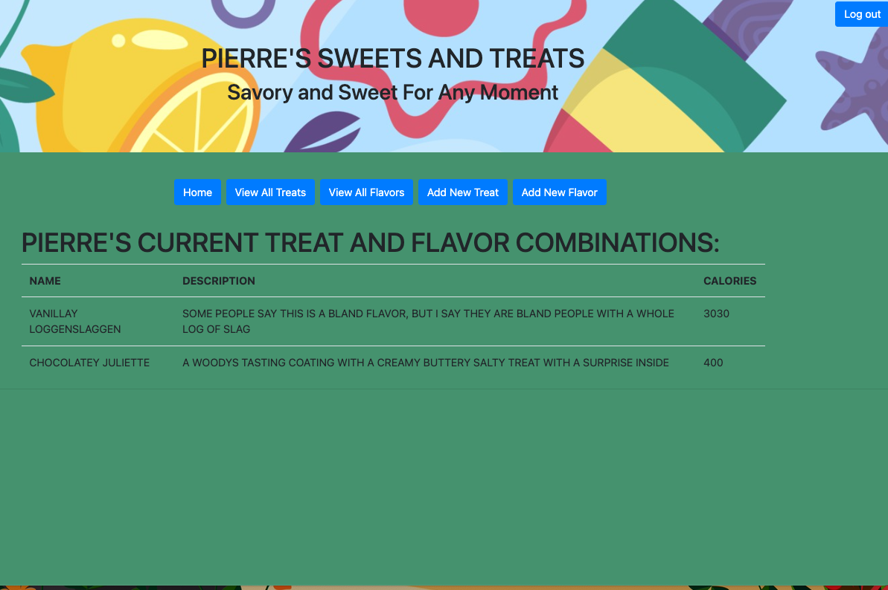

# _Pierre's Treats_

#### By _Liam Campbell_

#### _A C# database web app to display current treat and flavor combinations for Pierre's_

## Table of Contents

[Technologies Used](#technologies-used)  
[Description](#description)  
[Setup/Installation Requirements](#setup-and-installation-requirements)  
[Known Bugs](#known-bugs)  
[License](#License)

## Technologies Used

* _C#_
* _.NET_
* _HTML_
* _CSS_
* _SQL Workbench_
* _Entity Framework_
* _MVC_
_Microsoft Identity_

---
## Description
_This is a web application which can be used to add different and display different flavor-treat combinations. The information for each treat and flavor are stored in a database. Name, description, and calorie information can be entered for both. When a flavor is added to a treat the calories are added together and total calories are displayed when viewing that particular combination. The names are also added together as well as the descriptions. A Vanilla flavor added to a croissant becomes a vanillay croissant and the descriptions are combined flavor first, then treat compounded by "with". An authenticated user has full functionality and can create, update, delete as well as read both flavors and treats, while an unauthenticated user may only read._ 

---
## Setup and Installation Requirements

<strong>Initial Setup</strong>

<ol>
<li>Copy the git repository url: https://github.com/lcmpbll/PierresTreats
<li>Open a shell program and navigate to your desktop.
<li>Clone the repository for this project using the "git clone" command and including the copied URL.
<li>While still in the shell program, navigate to the root directory of the newly created file named "PierresTreats.Solution".
<li>From the root directory, navigate to the "PierresTreats" directory.
<li>Move onto "SQL Workbench" instructions below to re-create database necessary to run this project.
 

<strong>SQL Workbench Configuration</strong>

<ol>
<li>Create an appsetting.json file in the "PierresTreats" directory of the project*  
   <pre>PierresTreats.Solution
   └── PierresTreats
    └── appsetting.json</pre>
<li> Insert the following code** :  

<pre>{
  "ConnectionStrings": {
    "DefaultConnection": "Server=localhost;Port=3306;database=pierres_treats;uid=root;pwd=[YOUR-PASSWORD-HERE];"
  }
}</pre>
<small>*note: you must include your password in the code block section labeled "YOUR-PASSWORD-HERE".</small>
<small>**note: if you plan to push this cloned project to a public-facing repository, remember to add the appsettings.json file to your .gitignore before doing so.</small>

<li>Once "appsettings.json" file has been created, navigate back to SQL Workbench.

<strong>To Run</strong>

Navigate to:  
   <pre>PierresTreats.Solution
   └── <strong>PierresTreats</strong></pre>

Run `$ dotnet restore` in the console. 
Run `$ dotnet database update` in the console. 
Run `$ dotnet run` in the console

 

This program was built using *`Microsoft .NET SDK 5.0.401`*, and may not be compatible with other versions. Your milage may vary.

## Known Bugs

* Any known bugs

## License

_Feel free to reach out via [Github](github.com.lcmpbll) to provide feedback on this project or to view my other projects._

[Copyright](/LICENSE) (c) _07-28-2022_ _Liam Campbell_
